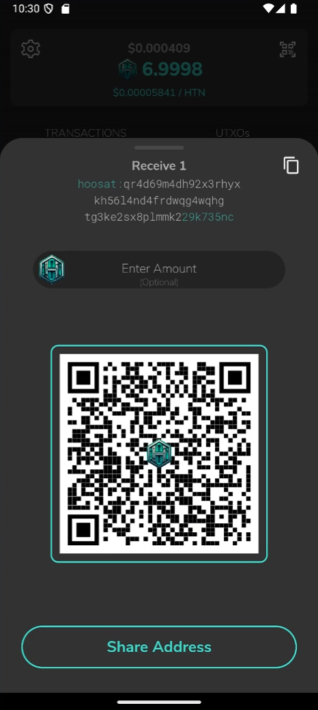

# Hoosat Mobile

Hoosat Mobile is a non-custodial wallet for the [Hoosat Network](https://network.hoosat.fi/)
BlockDAG, available for Android and iOS. It is written in
[Dart](https://dart.dev) using [Flutter](https://flutter.dev).

| Link                                                     | Description              |
|:---------------------------------------------------------|:-------------------------|
| [hoosat.fi](https://network.hoosat.fi/)          | Hoosat Network Homepage |

## Contributing

* Fork the repository and clone it to your local machine.
* Follow the instructions [here](https://flutter.io/docs/get-started/install)
  to install the Flutter SDK
* Setup [Android Studio](https://flutter.io/docs/development/tools/android-studio)
  or [Visual Studio Code](https://flutter.io/docs/development/tools/vs-code)

## Building

Android: 
```bash
flutter build apk
```

iOS: 
```bash
flutter build ios
```

If you have a connected device or emulator you can run the app right from your development machine.

Debug mode:
```bash
flutter run
``` 

Release mode:
```bash
flutter run --release
```

## Translations

For some details regarding translations, have a look at [Translations and translators](./TRANSLATORS.md).

## Screenshots

|  |  |  |
|----------------------------------|----------------------------------|----------------------------------|
|  |  |  |
